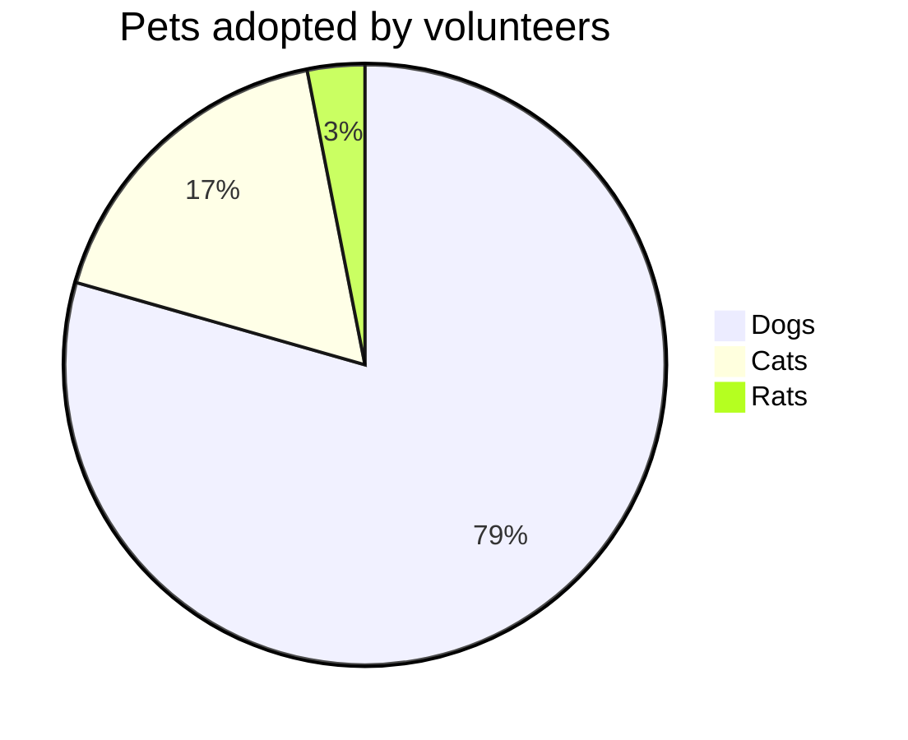

# {{cookiecutter.project_name}}

<!-- Uncomment and **UPDATE** the following links to integrate documentation status for Read the Docs and Testspace. -->
<!-- [](https://partsnap-llc-partsnap-cookiecutter-poetry.readthedocs-hosted.com/en/latest/?badge=latest) -->
<!-- [](https://partsnap.testspace.com/spaces/276170?utm_campaign=metric&utm_medium=referral&utm_source=badge "Test Cases") -->
<!-- [](https://partsnap.testspace.com/spaces/276170/current/Code%20Coverage?utm_campaign=metric&utm_medium=referral&utm_source=badge "Code Coverage (lines)") -->
<!-- [](https://partsnap.testspace.com/spaces/276170/current/Code%20Coverage?utm_campaign=metric&utm_medium=referral&utm_source=badge "Code Coverage (branches)") -->

{{cookiecutter.project_description}}

- **Github repository**: <https://github.com/partsnap/{{cookiecutter.project_name}}/>

<!-- Uncomment and **UPDATE** the following links to integrate documentation status for Read the Docs and Testspace. -->
<!-- - **Documentation** <https://partsnap-llc-{{cookiecutter.project_name}}.readthedocs-hosted.com/en/latest/> -->

## System Configuration (One Time)

[NIX Installation and Setup](https://partsnap.atlassian.net/wiki/spaces/SD/pages/113410049/NIX)

## Getting started with your project

---

**NOTE**: Make sure you have performed the
[initial system configuration](#system-configuration-one-time) **once**.

---

First, create/find a directory you want to clone the repository into and run this command:

```bash
git clone https://github.com/partsnap/{{cookiecutter.project_name}}.git
```

Finally, install the environment and run the pre-commit hooks:

```bash
make install
make check
make test
make docs
```

You are now ready to start development on your project!
The CI/CD pipeline will be triggered when you open a pull request, merge to main, or when you create a new release.

To finalize the set-up for publishing to PyPi or Artifactory, see [here](https://fpgmaas.github.io/cookiecutter-poetry/features/publishing/#set-up-for-pypi).
For activating the automatic documentation with MkDocs, see [here](https://fpgmaas.github.io/cookiecutter-poetry/features/mkdocs/#enabling-the-documentation-on-github).
To enable the code coverage reports, see [here](https://fpgmaas.github.io/cookiecutter-poetry/features/codecov/).

## Docker Setup

To run the Docker setup refer to [Docker Credential Setup](./docker.md)

Once the credentials have been set into a `.env` file, now run these commands:

```bash
# Choose one command to run for the login
# If you want to read
make docker-read-login
or
# If you want to read and push
make docker-push-login
make docker-build
make docker-start
make docker-stop
```


## Database CLI Useful Commands

Use these commands to populate and clear the database:

```bash
poetry run start-server

{{cookiecutter.project_slug}} db populate
{{cookiecutter.project_slug}} db clear

{{cookiecutter.project_slug}} --test-client api samples get 1
{{cookiecutter.project_slug}} --test-client api samples get 'world'
```

After starting the server, if the command `partshop` is throwing an error, reset your code editor or run these instead:

```bash
poetry run {{cookiecutter.project_slug}} db populate
poetry run {{cookiecutter.project_slug}} db clear

poetry run {{cookiecutter.project_slug}} --test-client api samples get 1
poetry run {{cookiecutter.project_slug}} --test-client api samples get 'world'
```


## Releasing a new version

- Create an API Token on [Pypi](https://pypi.org/).
- Add the API Token to your projects secrets with the name `PYPI_TOKEN` by visiting [this page](https://github.com/partsnap/{{cookiecutter.project_name}}/settings/secrets/actions/new).
- Create a [new release](https://github.com/partsnap/{{cookiecutter.project_name}}/releases/new) on Github.
- Create a new tag in the form `*.*.*`.

For more details, see [here](https://fpgmaas.github.io/cookiecutter-poetry/features/cicd/#how-to-trigger-a-release).


- Add the `ARTIFACTORY_URL`, `ARTIFACTORY_USERNAME`, and `ARTIFACTORY_PASSWORD` to your projects secrets by visiting [this page](https://github.com/partsnap/{{cookiecutter.project_name}}/settings/secrets/actions/new).
- Create a [new release](https://github.com/partsnap/{{cookiecutter.project_name}}/releases/new) on Github.
- Create a new tag in the form `*.*.*`.

For more details, see [here](https://fpgmaas.github.io/cookiecutter-poetry/features/cicd/#how-to-trigger-a-release).

---

Repository initiated with [partsnap/partsnap-cookiecutter-poetry](https://github.com/partsnap/partsnap-cookiecutter-poetry).

Here is a simple mermaid diagram



source:

````
    ```mermaid
    pie title Pets adopted by volunteers
        "Dogs" : 386
        "Cats" : 85
        "Rats" : 15
    ```
````

For more information see the [doc on github](https://github.com/partsnap/partsnap-cookiecutter-poetry)
